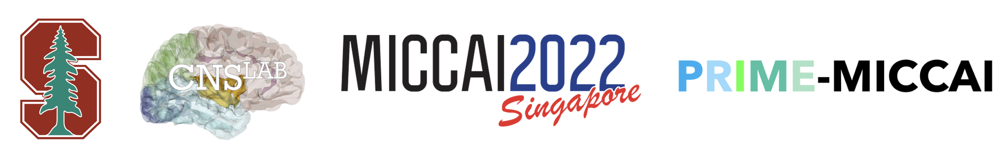
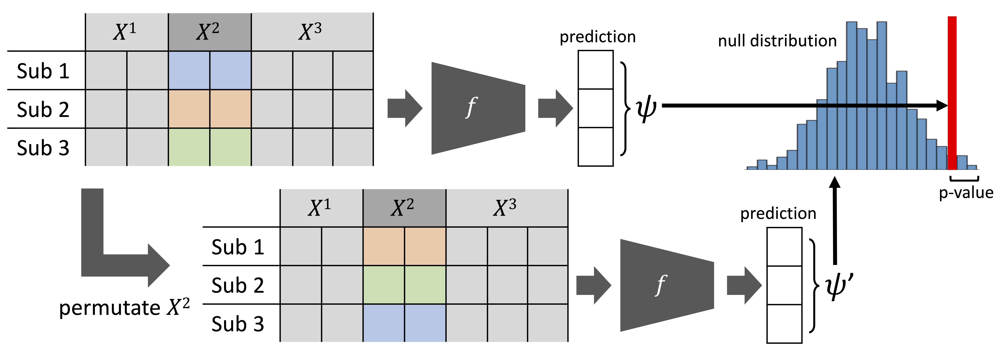

This repository provides the code for our paper **"Bridging the Gap Between Deep Learning and Hypothesis-Driven Analysis via Permutation Testing"** by M. Paschali, E. Adeli, Q. Zhao and K. M. Pohl published at the PRIME Workshop at MICCAI 2022.

## Abstract
A fundamental approach in neuroscience research is to test hypotheses based on neuropsychological and behavioral measures, i.e.,
whether certain factors (e.g., related to life events) are associated with an outcome (e.g., depression). In recent years, deep learning has become
a potential alternative approach for conducting such analyses by predicting an outcome from a collection of factors and identifying the most “informative” ones driving the prediction. However, this approach has had limited impact as its findings are not linked to statistical significance of factors supporting hypotheses. In this article, we proposed a flexible and scalable approach based on the concept of permutation testing that integrates hypothesis testing into the data-driven deep learning analysis. We apply our approach to the yearly self-reported assessments of 621 adolescent participants of the National Consortium of Alcohol and Neurodevelopment in Adolescence (NCANDA) to predict negative valence, a symptom of major depressive disorder according to the NIMH Research Domain Criteria (RDoC). Our method successfully identifies categories of risk factors that further explain the symptom.

## Method

Overview of the proposed permutation method, which we use to compute the significance of a category $X^2$ of factors for driving the prediction of model $f$. We first permute the values of $X^2$ across subjects (rows) and then measure the prediction accuracy based on the permuted input to derive a null distribution of the accuracy score $\psi^\prime$. The percentile of the true accuracy $ψ$ then defines the category’s statistical significance (or p-value).

## Code
After installing the <code>requirements.txt</code> you can run <code>train_eval_longitudinal_model.ipynb</code>to train the models and <code>infer_permutation-random.ipynb</code> to infer the permutations for each category.

## Dataset
The National Consortium on Alcohol and Neurodevelopment in Adolescence (NCANDA) study recruited 831 youths across five sites in the U.S. (University of California at San Diego (UCSD), SRI International, Duke University Medical Center, University of Pittsburgh (UPMC), and Oregon Health & Science University (OHSU)) and followed them annually. As our goal was to analyze adolescent depressive symptoms, we used data from 621 participants who completed at least one assessment before turning 18 years old. The data were part of the public release NCANDA\_PUBLIC\_6Y\_REDCAP\_V01 [1].

[1] Pohl, K.M., et al.: The NCANDA_PUBLIC_6Y_REDCAP_V01 data release of the national consortium on alcohol and neurodevelopment in adolescence
(NCANDA) (2021). https://doi.org/10.7303/syn25606546

## Reference

If you find our code useful please cite our work:

> Magdalini Paschali, Qingyu Zhao, Ehsan Adeli, Kilian M. Pohl:
Bridging the Gap between Deep Learning and Hypothesis-Driven Analysis via Permutation Testing. International Workshop on PRedictive Intelligence In MEdicine, PRIME-MICCAI, 2022

 

> @article{paschali2022prime, 
  title={Bridging the Gap between Deep Learning and Hypothesis-Driven Analysis via Permutation Testing}, 
  author={Paschali, Magdalini and Zhao, Qingyu and Adeli, Ehsan and Pohl, Kilian M}, 
  journal={International Workshop on PRedictive Intelligence In MEdicine, PRIME - MICCAI}, 
  year={2022} 
}

## Contact

Please contact paschali {at} stanford {dot} edu for questions about the dataset used for this work.

## Acknowledgements 
This study was in part supported by the National Consortium on Alcohol and Neurodevelopment in Adolescence (NCANDA) by means of
research grants from the National Institute on Alcohol Abuse and Alcoholism (NIAAA) AA021697 (PI: KMP) and AA028840 (PI: QZ). The research was also supported by the Stanford Human-Centered Artificial Intelligence (HAI) Google Cloud Credit (PI: KMP).
